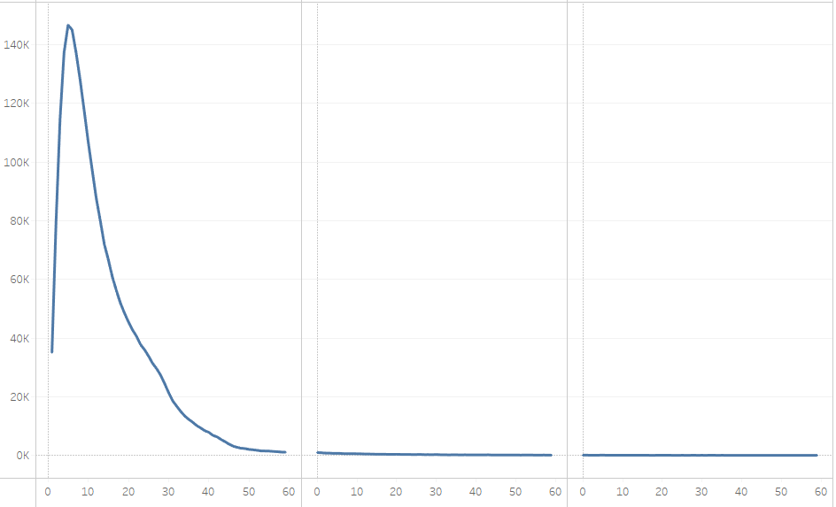
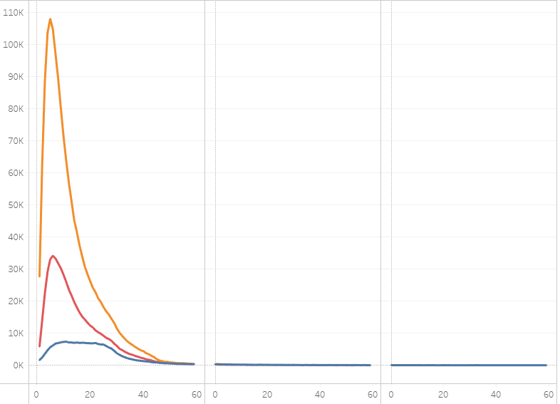
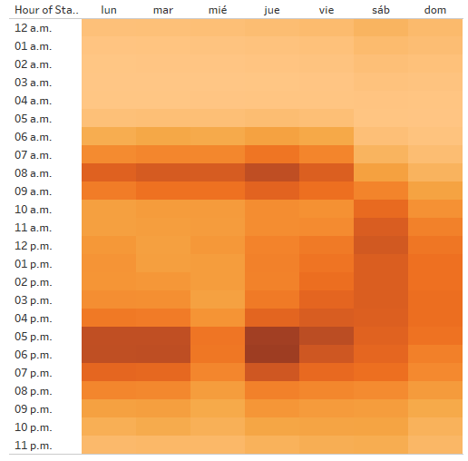
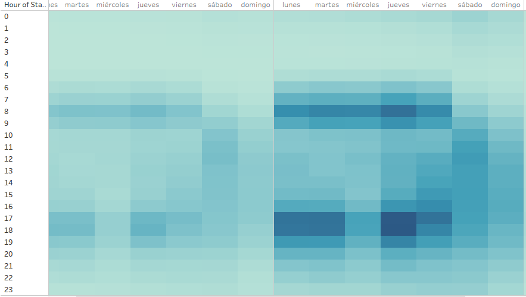
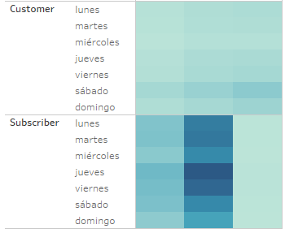

# Challenge 14
## Overview of the statistical analysis
The puspose of this analysis is to detemine statistical information about the users of the company, when do they use the service, what gender they identify as, and lastly what kind of users are they.

## Results

### Summary

The things we realized are the following:
- More males than any other gender use the service.
- The usage on weekdays is higly skewed toward the begining and end of the work day.
- On weekends the usage averages out.
- The is an un usual increase in usage in thursdays.
- Most of the rides are under 30 minutes.

[Link to the dashboard](https://public.tableau.com/app/profile/jacobo.pesel/viz/Challenge14_16345986548500/Story1?publish=yes)
